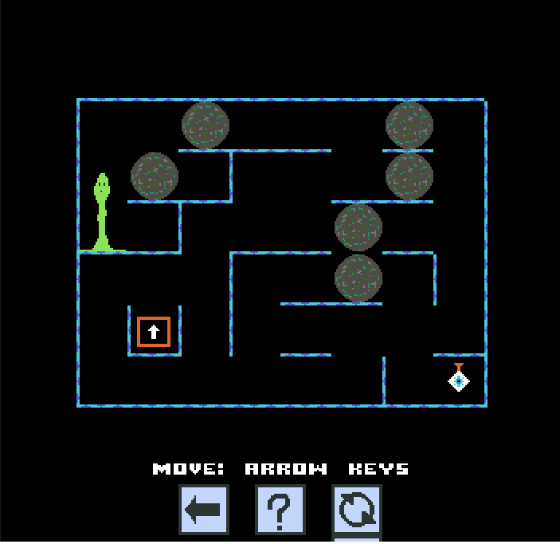

# Boulders puzzle game

A puzzle platform game where you have to collect a diamond and
leave by the exit. Push boulders around to reach your targets, but avoid
sqaushing them or getting trapped!

This is a very simple implementation using the
[Indigo game engine](https://indigoengine.io/), not intended to be a
high (or even medium) quality game for public consumption.
Graphics were (badly) drawn using [Aseprite](https://www.aseprite.org/).

It exists to test the automatic generation of the levels (see [this
repository](https://github.com/auto-gen-games/boulders-generate)). A
sample set of 20 generated levels is included in the game.  

But it is still fun to play if you like a little puzzle :-)

Please see the
[Indigo setup instructions](https://indigoengine.io/docs/quickstart/setup-and-configuration)
on how to build and run the game in your web browser.
Note that this game's build script is in
[Mill](https://github.com/lihaoyi/mill).

